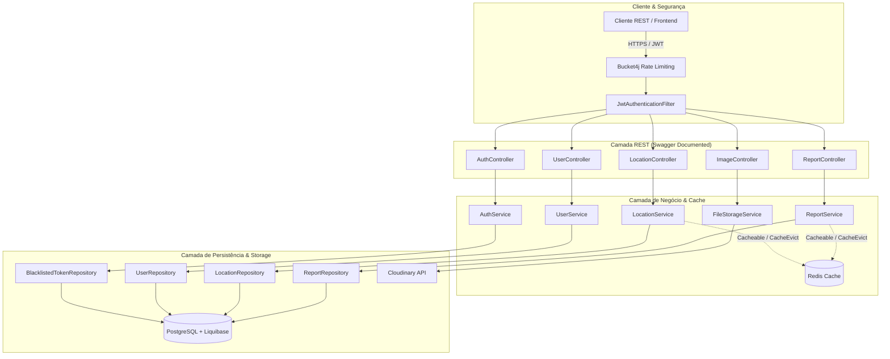

# CAIP-BackEnd: Sistema de Controle de Achados e Perdidos

O CAIP-BackEnd é a API RESTful por trás do **Sistema CAIP**, uma solução robusta para gerenciamento de itens achados e perdidos. Construído com as tecnologias mais modernas do ecossistema Java e Spring, o projeto foi desenhado para ser seguro, performático e escalável.


## ✨ Features Principais

- **API RESTful Completa:** Endpoints para gerenciamento de usuários, registros de itens, localizações e mais.
- **Autenticação e Autorização com JWT:** Sistema de segurança moderno para proteger os dados da aplicação.
- **Versionamento de Banco de Dados com Liquibase:** Migrations automatizadas para manter o banco de dados consistente em todos os ambientes.
- **Performance Otimizada:** Uso de cache com Redis para acelerar consultas frequentes.
- **Rate Limiting:** Proteção contra abuso e ataques de força bruta.
- **Documentação Interativa com Swagger:** Interface para visualizar e testar os endpoints da API facilmente.
- **Análise de Vulnerabilidades:** Verificação automática de dependências com OWASP.

## 🛠️ Stack Tecnológica

| Categoria              | Tecnologia                                      | Propósito                                           |
| ---------------------- | ----------------------------------------------- | --------------------------------------------------- |
| **Core & Web**         | Java 17, Spring Boot 3.4, Spring Web            | Base da aplicação e exposição de APIs REST.        |
| **Persistência**       | Spring Data JPA, PostgreSQL, Liquibase          | Armazenamento de dados e versionamento de schema.   |
| **Segurança**          | Spring Security, JWT (jjwt), OWASP Plugin       | Autenticação, autorização e análise de segurança. |
| **Performance**        | Redis, Redisson, Bucket4j, Spring Cache         | Cache distribuído e limitação de taxa (Rate Limiting). |
| **Serviços Externos**  | Cloudinary                                      | Armazenamento de imagens na nuvem.                  |
| **Qualidade & Testes** | JUnit 5, Testcontainers, WireMock, Jacoco       | Testes de unidade, integração e cobertura de código. |
| **Dev Experience**     | Lombok, MapStruct, SpringDoc (Swagger)          | Redução de boilerplate, mapeamento e documentação.  |
| **Containerização**    | Docker, Docker Compose                          | Empacotamento e orquestração da aplicação.          |

## 🚀 Como Executar o Projeto

### Pré-requisitos

- Java 17+
- Maven 3.8+
- Docker e Docker Compose (recomendado)

### 1. Usando Docker (Recomendado)

A maneira mais simples de subir a aplicação completa, incluindo o banco de dados PostgreSQL e o Redis.

1.  **Clone o repositório:**
    ```bash
    git clone <https://github.com/MarllonAnisio/CAIP-BackEnd>
    cd CAIP-BackEnd
    ```

2.  **Construa a imagem Docker:**
    O projeto já vem com um `Dockerfile` otimizado. Para construir a imagem, execute:
    ```bash
    docker build -t marllon/caip-backend .
    ```

3.  **Suba os serviços com Docker Compose:**
    O arquivo `docker-compose.yml` irá orquestrar a aplicação, o banco de dados e o Redis.
    ```bash
    docker-compose up -d
    ```

A aplicação estará disponível em `http://localhost:8080`.

### 2. Executando Localmente (Sem Docker)

1.  **Inicie o Banco de Dados e o Redis:**
    Você precisará ter instâncias de PostgreSQL e Redis rodando localmente ou em algum lugar acessível.

2.  **Configure as variáveis de ambiente:**
    A aplicação é configurada via variáveis de ambiente ou por um arquivo `application.properties`. As principais variáveis a serem configuradas são:

    - `SPRING_DATASOURCE_URL`
    - `SPRING_DATASOURCE_USERNAME`
    - `SPRING_DATASOURCE_PASSWORD`
    - `SPRING_REDIS_HOST`
    - `SPRING_REDIS_PORT`
    - `JWT_SECRET`
    - `CLOUDINARY_URL`
    - `CORS_ALLOWED_ORIGINS`

3.  **Execute a aplicação com Maven:**
    ```bash
    mvn spring-boot:run
    ```

## 📖 Documentação da API (Swagger)

Com a aplicação em execução, a documentação interativa da API estará disponível em:

[**http://localhost:8080/swagger-ui.html**](http://localhost:8080/swagger-ui.html)

Nesta interface, você pode:
- Visualizar todos os endpoints disponíveis.
- Ver os modelos de dados (DTOs) de request e response.
- Testar os endpoints diretamente pelo navegador.

## 🧪 Executando os Testes

Para garantir a qualidade e a estabilidade do código, execute a suíte de testes com o Maven:

```bash
mvn clean verify
```

Este comando irá:
- Compilar o projeto.
- Executar os testes de unidade e integração (usando Testcontainers para criar instâncias de banco de dados e Redis em tempo de execução).
- Gerar o relatório de cobertura de testes do Jacoco em `target/site/jacoco/index.html`.
- Executar a análise de vulnerabilidades do OWASP.

---

## 🏛️ Arquitetura e Fluxo do Sistema

O projeto adota uma arquitetura em camadas modularizada por **Domínios (DDD-lite)** (`auth`, `user`, `report`, `location`, `image`), garantindo separação clara de responsabilidades, alta testabilidade e baixo acoplamento:



### Destaques Arquiteturais:
- **Rotinas de Segurança:** Autenticação stateless com JWT, rotação contínua de refresh tokens e controle de blacklist persistida para invalidação imediata em logout.
- **Auditoria Automática:** JPA Auditing (`@CreatedBy`, `@CreatedDate`, `@LastModifiedBy`) integrado de forma nativa na classe base `BaseAuditableEntity`.
- **Soft Delete vs Hard Delete:** Registros de reports utilizam exclusão lógica (`deleted = true`) com anotações `@SQLDelete` e `@SQLRestriction`, preservando histórico e possibilitando auditoria, com rota administrativa dedicada para exclusão física.
- **Gerenciamento Desacoplado de Imagens:** Upload via `FileStorageService` abstraindo o Cloudinary, permitindo substituição simples por outros provedores (como AWS S3).


